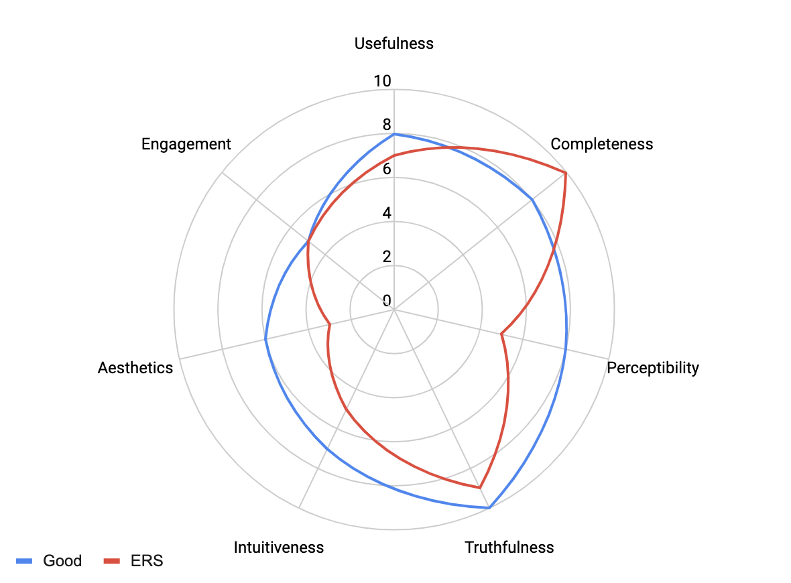

# Assignment 3 + 4: Critique by Design

## Step 1: finding a data visualization

I decided to use Economic Research Service's visualization on food expenditure series to complete this assignment. [Source](https://www.ers.usda.gov/data-products/chart-gallery/gallery/chart-detail/?chartId=99193)

To briefly summarize, this graph shows the total food sales and breaks it down to food at home and food away from home from January 2019 to June 2020. The data from this graph can be found by going to this [link](https://www.ers.usda.gov/data-products/food-expenditure-series/) and clicking the "Monthly sales of food, with taxes and tips, for all purchases".

## Step 2: critiquing the data visualization

To critique this visualization, we will be using Stephen Few's Data Visualization Effectiveness Profile. The seven criteria include usefulness, completeness, perceptibility, truthfulness, intuitiveness, aesthetics, and engagement. Below is a chart to describe what the scores of a good chart is versus what the ERS graph score

### Usefulness

The graph shows information from 2019 and 2020 to point out the change in customer behavior after the pandemic started. It could be useful but takes quite a while to comprehend it.  

### Completeness

There is a lot of data included in the information; there's information regarding food at home and food away from home. It also shows the total sale of food each year so that the audience can understand how the numbers are changing altogether. 

### Perceptibility

Because of how the data is presented in a double bar graph, users are forced to make harder comparisons between each category since the bars are not connected. In a sense, the audience has to alternate between reading food information away from home and food at home, which can be difficult to perceive. Additionally, the colors are distracting. While users can easily see the total sales in the green line, it is more challenging to make the comparison between the other information.

### Truthfulness

The reason this graph is a 9 and not a 10 is because of the number labels. Notice that in January 2019, the food at home and food away from home are both labeled as 64 billion dollars. However, the length of the chart does not match. The reason behind this is because of rounding numbers, but the illustrator did not make that clear.  

### Intuitiveness

This graph is not easily understood because it takes a while to digest. There is too much information on the graph and the visualization used impairs the reader from grasping the content quickly. Some users have a difficult time interpreting double bar charts and making comparisons from that. 

### Aesthetics

The color scheme and visualization type are terrible because the colors are distracting and the bars increase cognitive overload. On top of that, there are number labels on every data point, which takes up the white space. The arrows at the bottom are unnecessary. 

### Engagement

All things considered, this graph would most likely not draw audience into the data because of the lack of aesthetics, intuiveness, and perceptability. 

### What I would do differently

- I would change the color scheme
- I would change the type of visualization used. I might even make two visualizations instead (one to present food at home versus food away from home and another to present total food sales).
- I would omit the number labels and only focus on important points (perhaps the difference from April 2019 to April 2020).
- I would take out the arrows on the year.
- I would rearrange the graphed values, lines, and legend so that they are closer to one another.

## Step 3: Wireframing a solution

I started by drawing a few ideas on paper. This is a really rough sketch to get a sense of what I want to make when I actually do wireframe it. 

After that, I started transferring these drawings into Figma. Below are the four ideas that I focused on: 

#### 1. Bar chart

#### 2. Stacked chart

#### 3. Line chart

#### 4. 100% Stacked chart

## Step 4

## Step 5

<object class='tableauViz'  style='display:none;'>
  <param name='host_url' value='https%3A%2F%2Fpublic.tableau.com%2F' /> 
  <param name='embed_code_version' value='3' /> 
  <param name='site_root' value='' />
  <param name='name' value='Assignment34_16442870976310&#47;Sheet1' />
  <param name='tabs' value='no' /><param name='toolbar' value='yes' />
  <param name='animate_transition' value='yes' />
  <param name='display_static_image' value='yes' />
  <param name='display_spinner' value='yes' />
  <param name='display_overlay' value='yes' />
  <param name='display_count' value='yes' />
  <param name='language' value='en-US' />
  <param name='filter' value='publish=yes' />
  </object>

                

