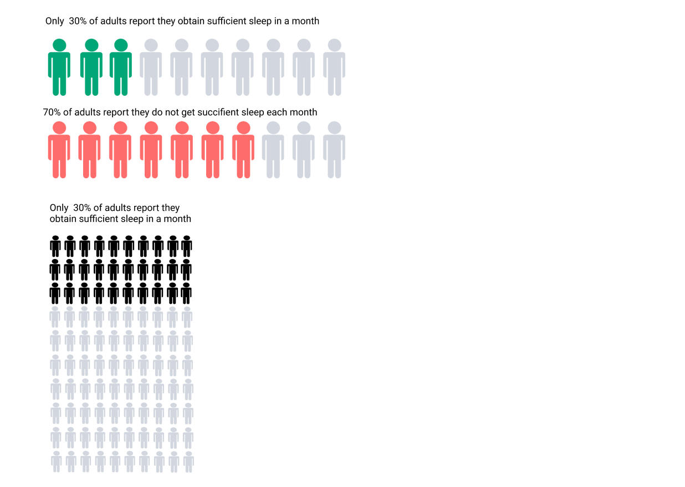
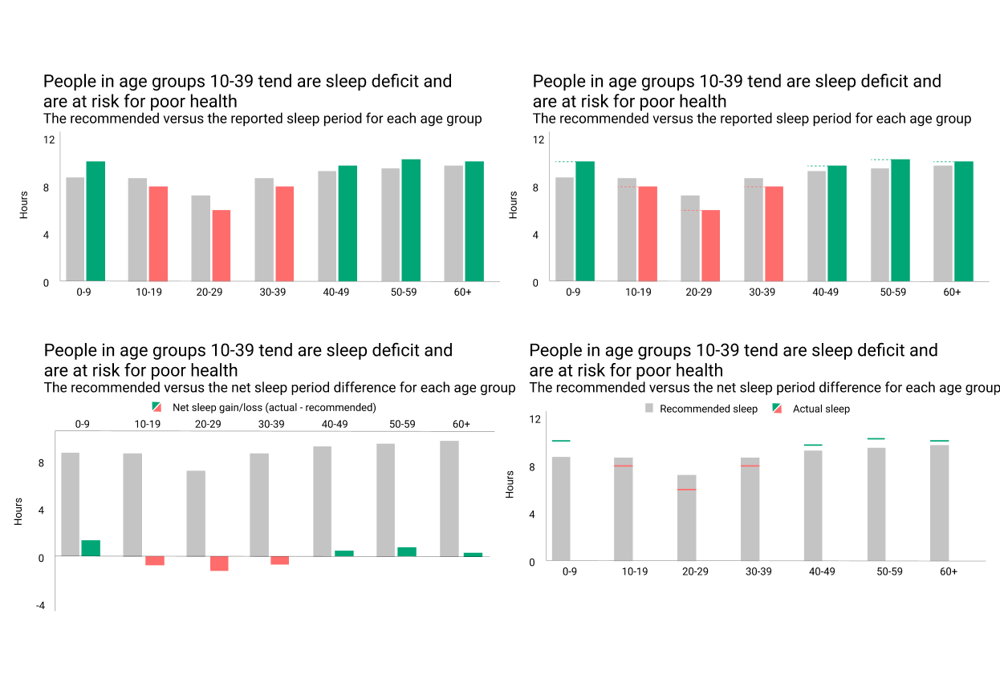
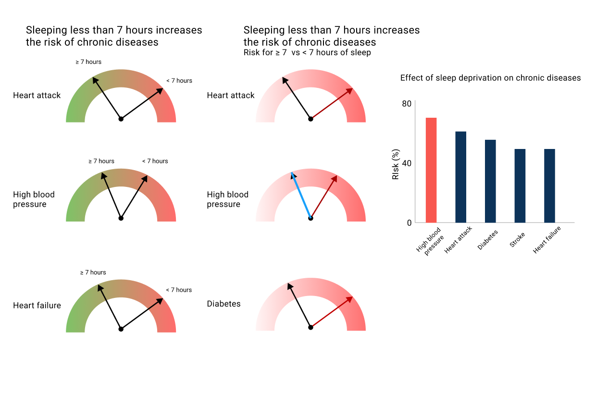
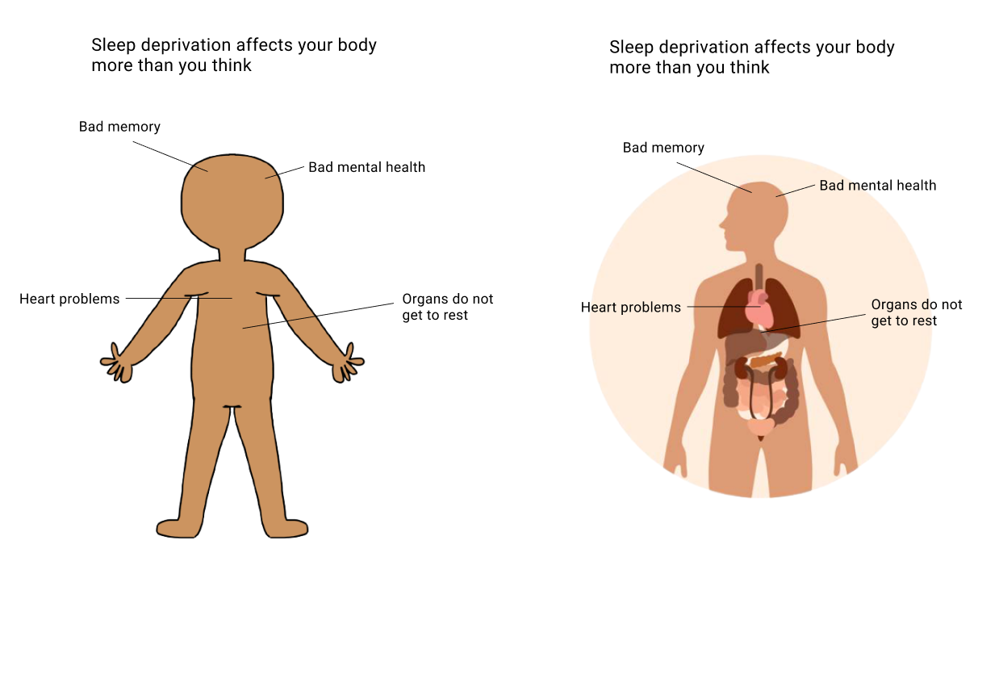
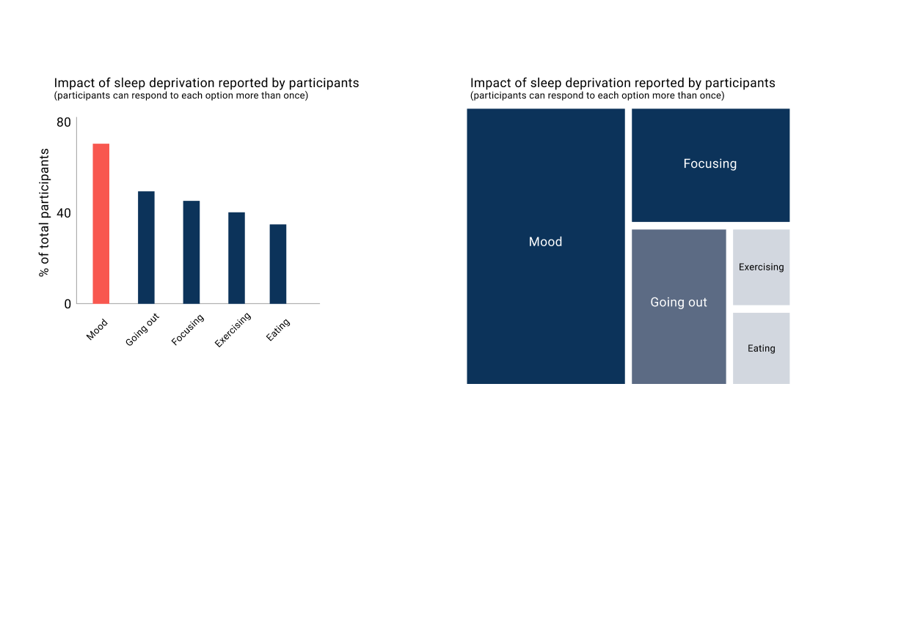
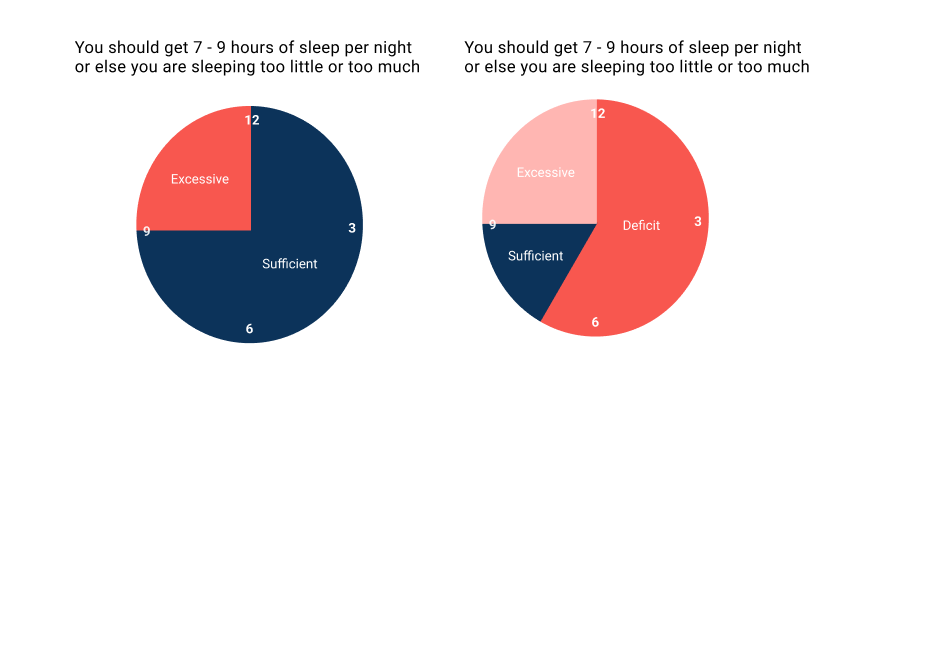
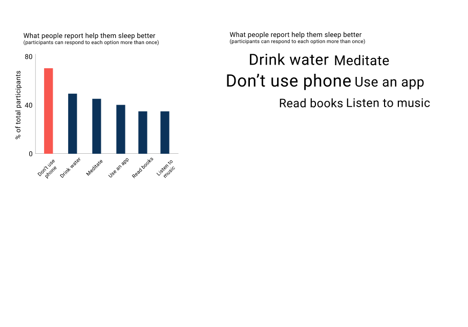
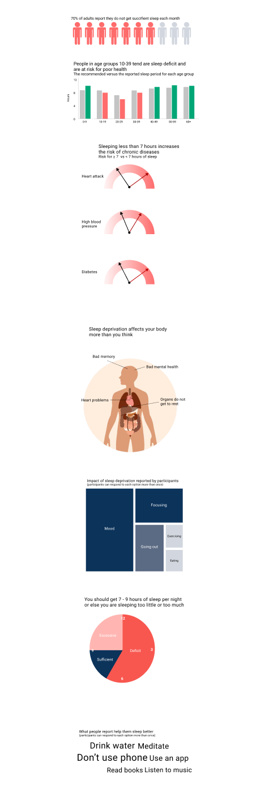

# Final Project Part 2

## High-fidelity visualizations and ideas

From the conversations with my peers and interviewees, I decided to limit the number of graphs and information that I tackle. For instance, in the first part of the project, I included a couple of graphs where I talked about how gender impacts certain phenomenons like how much sleep a person gets or how much more at risk a person is for a specific chronic disease. However, adding too much information takes away from the main story and distracts users from focusing on getting better sleep.

In this sectionm I will show 7 different concepts, in which each concept may be represented differently depending on what I came up with. I will comment on some of the graphs to show my thought process about why I chose to go with specific ones. 

  

When I was first creating this graph, the information that I saw was 30% of the people obtain sufficient sleep. I knew that I wanted to use a dot matrix chart to emphasize the small number, but I was not sure how I wanted to display the data. You can see here that I showed all 100 dots as well as just 10 dots. I also rephrased how the information is presented to give more urgency to it. After careful consideration, I picked the 10 dots one as my final visualization because that does not overwhelm the user and the point is easily delivered. At the same time, talking about what is missing from something as supposed to what they already have is more engaging. 

  

I wanted to explore different options in terms of this context because there is a lot of information to be presented but at the same time, showing them in a particular way might be better than others. For me, the graph at the bottom left is the most intuitive because I was used to seeing the revenue and net profit/loss graph. I soon realized that most people might not be used to it and might not be able to quickly receive the information. Hence, the top-left option is the most straightforward and noticeable one. The reason why I did not like the ones on the right as much is that the top one has too many lines that make it confusing and the bottom one has such a thin line that it is hard to notice.  

  

  

Unlike the previous graphs, the differences are less significant in which it is just whether we use a human with no label or with an anatomy label. Initially, I wanted to go with the human with no label since that subtracts noise from the data. However, when people are reading this, I think they will get the sense of urgency more from seeing real organs and how those are impacted by sleep deprivation. Hence, I chose to include the right option in my wireframe.

  

  

I really like this visualization and think it is a really creative idea. However, one question I had while making this is the slices seem to make the hours of sleep discrete values. Is there a way to convey it such that it becomes more continuous? 

  

After looking at the overarching theme and the flow of the information as a whole, I was able to choose which graph I wanted to display in the actual storyboard. 

## Finalized wireframe/storyboard

  

## User research and interviews

## Final thoughts and upcoming changes

