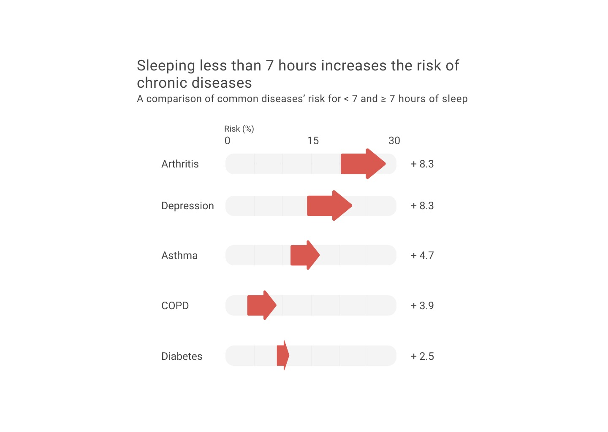
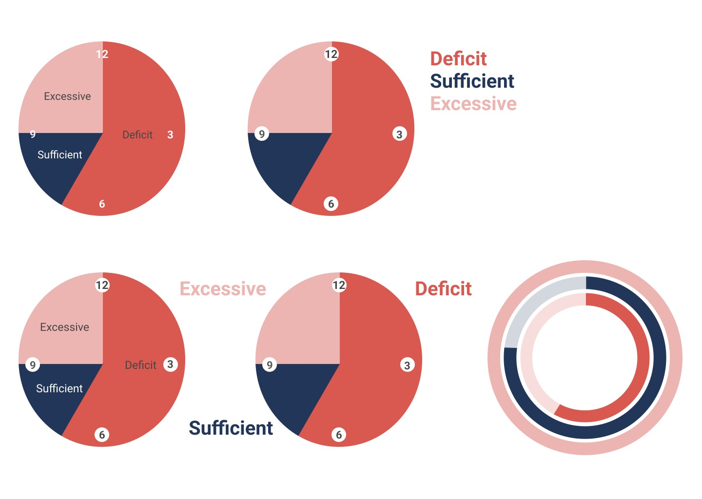
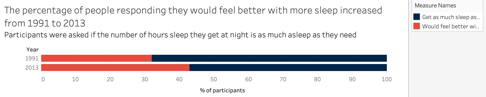
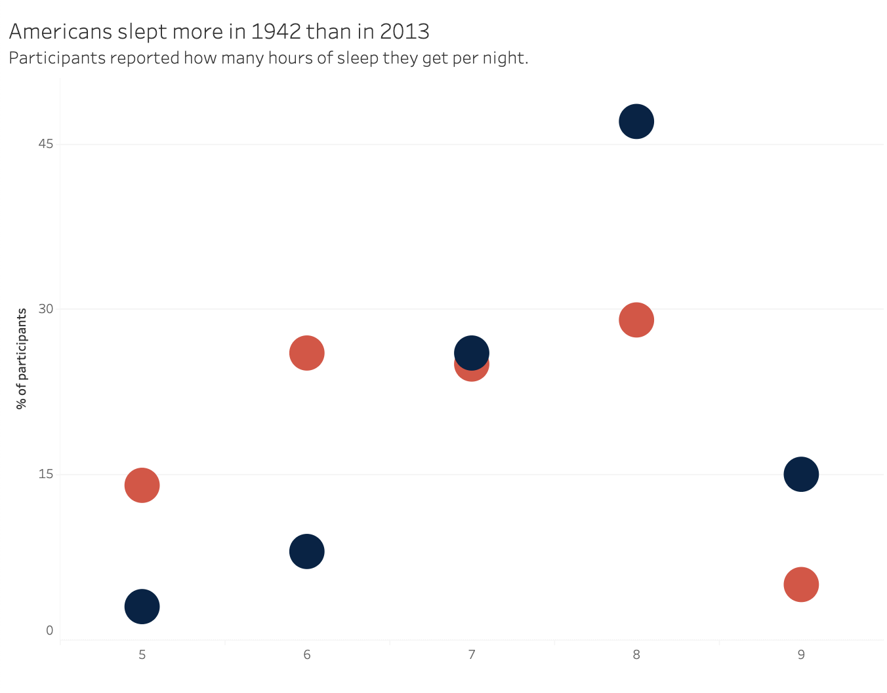
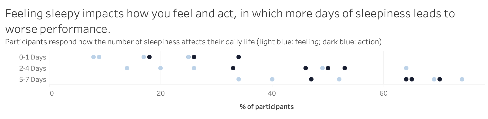

## Final Project Part 3

[Part 1](https://chanalee.github.io/94470/fp-part1.html)

[Part 2](https://chanalee.github.io/94470/fp-part2.html)

[Data Story](https://carnegiemellon.shorthandstories.com/sleep/index.html)

### Intended Audience

With sleep applying to people of all ages, gender, and nationality, my audience includes everybody. Initially, my data story was aimed to target people who are in college. As a college student myself, I am aware of the unhealthy decisions that we make and would like to inform other students to develop healthy habits instead. By promoting good hygiene, people will be able to mitigate certain risks that come with sleep deprivation.

However, after learning more on the topic, I decided to focus on people who are aged 18 - 29 because this group of people is the one that has the least amount of sleep among adults and is the most prone to different disorders as a result of their actions. I also realized that sleep deprivation is more common than I thought. Hence, rather than just focusing on a small group, I could reach a broader audience in which in this case there is a one size fits all solution. Throughout the final story, I specifically highlighted this group as well as 30 - 49 to show that they are way below average.

### Design Decisions 

While I kept most of my storyline the same, I made a few adjustments on the type and the way I am displaying the information. I added a couple new graphs to enhance my story, as well as reformat my previous graphs. 

For example, I changed the way that chronic diseases' risks were displayed. Instead of using a spedometer, I combined a bar chart with some graphics to demonstrate the difference of risk for sufficient versus insufficient sleep.

  

I also played around with the design of the recommended hours of sleep. Personally, I prefer the second one on the top row because I like how modern the design looked. However, I went back and ask my interviewees to see what they thought of the graphic. They commented that while it is more aesthetically pleasing, the one on the bottom left does a better job since the information is grouped more closely. This means that you can see everything altogether, which means less time to process. 

  

I played around with different ideas that I did not end up using. For example, the graph below shows similar information to my final graph. However, instead of including just the responses with "yes", I included but "yes" and "no" to make a stacked chart. After further consideration, I felt that this was unncessary and that a simple bar graph would do.

  

From this graph, I started thinking about how I could demonstrate my data differently. I decided to explore different ways to visualize the data and group information differently. After multiple iterations, I changed a simple comparative bar graph to these graphs. The reason that I did not want to use a line chart for these graphs is because line graphs are usually associated with continuity of the x-axis. Therefore, even though it might be a bit easier to read, I thought that it was unsuitable because people might also get confused by it. 

  

  

In terms of the way that the story is told, I took the advice that my interviewees told me to include more transitional materials and emphasized headlines. I did that by using features on shorthand like images to divide the sections or just a different background color for emphasis. 

I also played around with the typography and color of the text in order to enhance certain information!

### Progress and Learning Points

### Updated Data Sources

My first data source is located [here](https://www.cdc.gov/sleep/data_statistics.html). This dataset will be used to show how the risks of not getting sufficient sleep.

My second data source is located [here](https://news.gallup.com/poll/166553/less-recommended-amount-sleep.aspx). It is a dataset on how long each age group sleeps. It also compares sleep across different time periods.

My third data source is located [here](https://www.sleepfoundation.org/how-sleep-works/sleep-facts-statistics). The primary purpose of this source is to highlight certain information and create emphasized visualizations to make a statement. Unlike the previous two sources, this source is primarily an aggregation of different stastical sources and reported into one to create an article on sleep statistics. I know that I will definitely be able to learn more about sleeping patterns to help shape my narrative better. 

My fourth data source is located [here](https://www.sleepfoundation.org/wp-content/uploads/2020/03/SIA-2020-Q1-Report.pdf). This article contains information on how sleep deprivation affects daily activities. This is related to how sleep deprivation affects mental health and can be used to support how sleep deprivation leads to an unproductive lifestyle. Additionally, this [page](https://www.sleepfoundation.org/professionals/sleep-america-polls) contains polls from previous years that I can learn about. There is also information on the comparison of sleep schedules for weekdays versus weekends, statistics of how many percent of people felt well-rested, and more!

### Other References
 
- Blackwelder, Amanda. “Effect of Inadequate Sleep on Frequent Mental Distress.” Centers for Disease Control and Prevention, Centers for Disease Control and Prevention, 17 June 2021, https://www.cdc.gov/pcd/issues/2021/20_0573.htm.
- “How Sleep Loss Affects Your Body.” UPMC HealthBeat, 29 Aug. 2018, https://share.upmc.com/2016/10/sleep-loss-effects/#:~:text=People%20who%20get%20less%20than,for%20heart%20attack%20and%20stroke.
- Hirshkowitz, Max, et al. “National Sleep Foundation's Sleep Time Duration Recommendations: Methodology and Results Summary.” Sleep Health, U.S. National Library of Medicine, Mar. 2015, https://pubmed.ncbi.nlm.nih.gov/29073412/.
- Jones, Jeffrey M. “In U.S., 40% Get Less than Recommended Amount of Sleep.” Gallup.com, Gallup, 4 June 2021, https://news.gallup.com/poll/166553/less-recommended-amount-sleep.aspx.
- “Mind, Body and Sport: Sleeping Disorders.” NCAA.org, https://www.ncaa.org/sports/2014/11/5/mind-body-and-sport-sleeping-disorders.aspx.
- Osmun, Rosie. “Oversleeping: The Effects & Health Risks of Sleeping Too Much.” Amerisleep, 11 Oct. 2021, https://amerisleep.com/blog/oversleeping-the-health-effects/.
- Pacheco, Danielle. “Physical Health and Sleep: How Are They Connected?” Sleep Foundation, 24 June 2021, https://www.sleepfoundation.org/physical-health.
- “Sleep by the Numbers.” National Sleep Foundation, 14 May 2021, https://www.thensf.org/sleep-facts-and-statistics/.
- “Sleep Tips: 6 Steps to Sleep Better.” Healthi, https://www.healthi.in/articles/sleep-tips-7-steps-to-better-sleep-ART-20048379.
- Suni, Eric. “Mental Health and Sleep.” Sleep Foundation, 18 Sept. 2020, https://www.sleepfoundation.org/mental-health.
- Watson, Stephanie. “11 Effects of Sleep Deprivation on Your Body.” Healthline, Healthline Media, 15 Dec. 2021, https://www.healthline.com/health/sleep-deprivation/effects-on-body.

