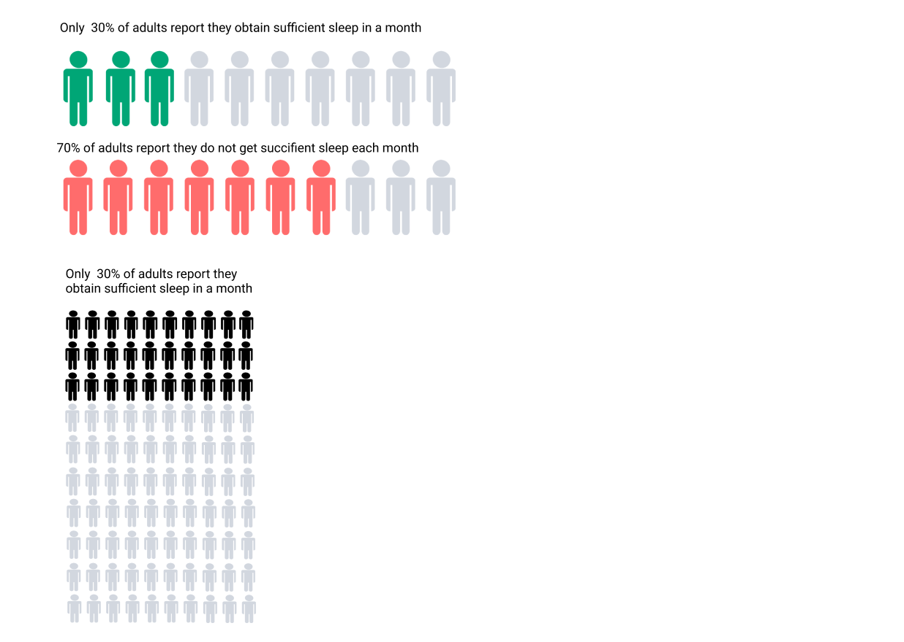
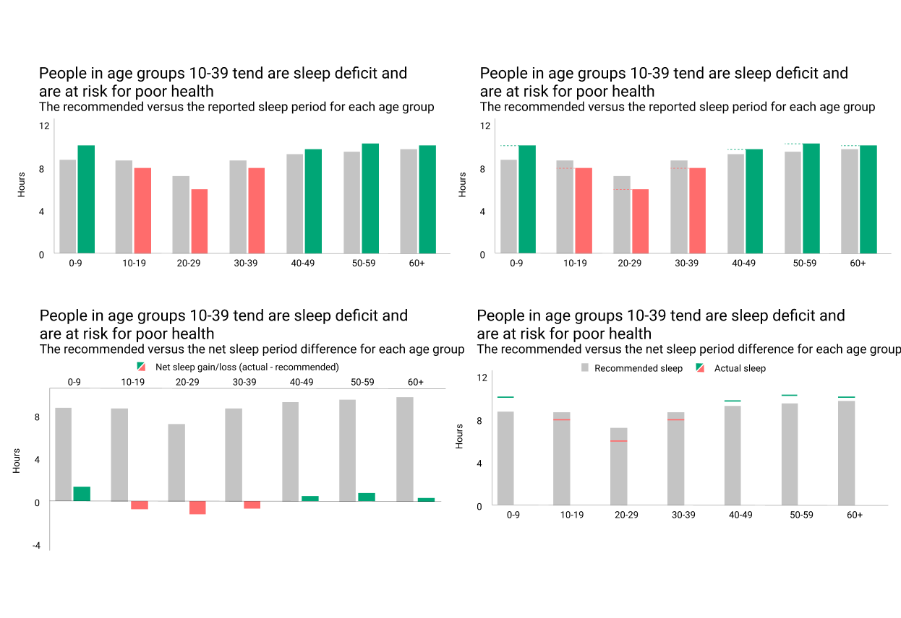
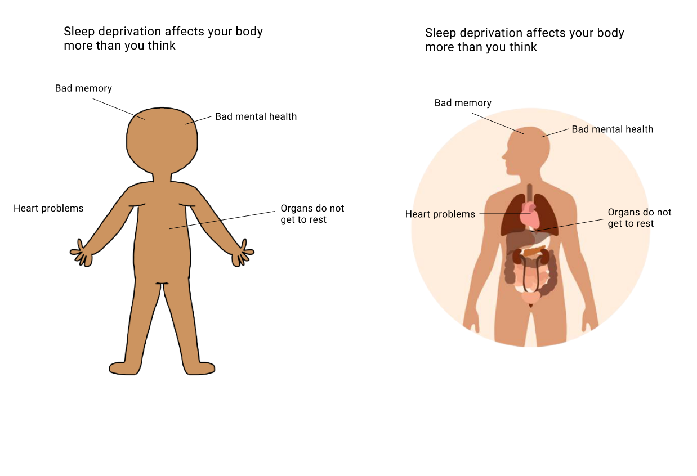
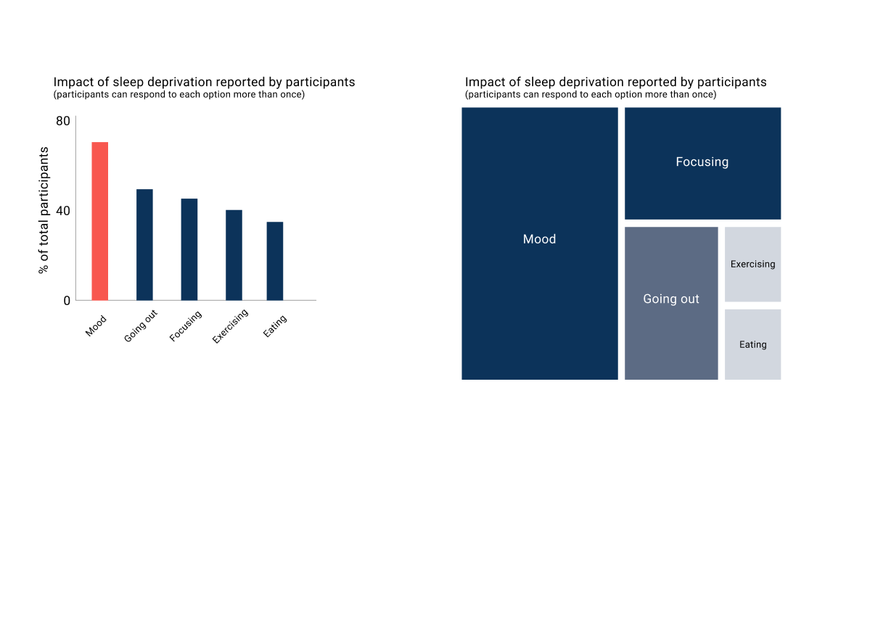
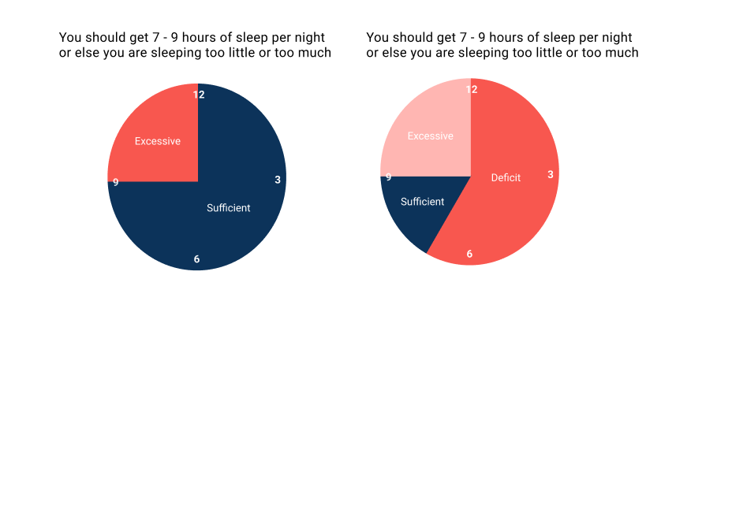
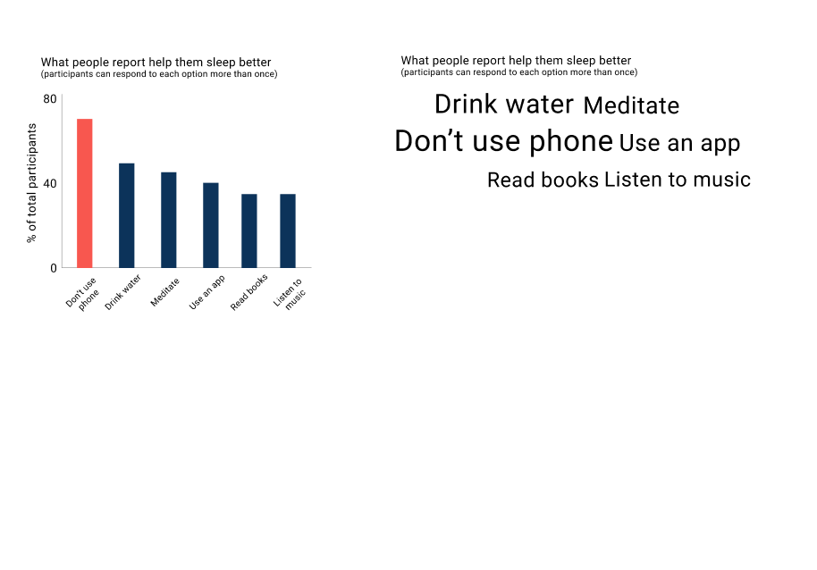

# Final Project 

[Part 1](https://chanalee.github.io/94470/fp-part1.html)

[Part 2](https://chanalee.github.io/94470/fp-part2.html)

[Data Story](https://carnegiemellon.shorthandstories.com/sleep/index.html)

# Final Project Part 1

## Outline

High-level summary: People are underestimating the impact of getting a good night sleep and are harming their physical and mental health in doing so.

1. The average American adult reports about two nights of insufficient sleep per week (many age groups are sleep-deprived).
2. Sleep deprivation increases the risk of chronic diseases such as high blood pressure, diabetes, heart attack, heart failure, and stroke.
3. Sleep deprivation can also hinder you from thinking clearly and increase the odds of mental distress.
4. A vicious cycle of mental distress and sleepless nights exists. 
5. But what about excessive sleeping? That's also not healthy.
6. (So how do I) Sleep just right! 

## Initial Sketches

Here are some sketches of what I am planning to do. Notice that there is a number next to each graph - this number corresponds to which section the graph belongs to. These sketches are subject to change depending on the information found and flow of story. 

 

## Method and Medium

For the wireframe and storyboard component, I will be using Figma. Because I am already used to Figma's interface, I thought it would be the most convenient way to test out my high-fidelity prototypes. That way, it will allow me to save time using something that I am comfortable with and will also allow me to produce results that are reflective of my sketched prototypes faster. 

For the data visualization component, I will be using Tableau. The primary reasons for using Tableau are its flexibility and my passion to explore Tableau more. Without a doubt, Tableau is one of the most versatile visualization tools, and considering the types of data that I will be using, I am confident that Tableau will be able to support my needs. Additionally, I hope to develop more skills in Tableau, meaning that practicing and creating visualizations in Tableau will help me achieve my goal. Another software that I am considering using is RAWGraphs.   

For the presentation component, I will be using Shorthand after I have generated the charts and refined my story.

# Final Project Part 2

## High-fidelity visualizations and ideas

From the conversations with my peers and interviewees, I decided to limit the number of graphs and information that I tackle. For instance, in the first part of the project, I included a couple of graphs where I talked about how gender impacts certain phenomenons like how much sleep a person gets or how much more at risk a person is for a specific chronic disease. However, adding too much information takes away from the main story and distracts users from focusing on getting better sleep.

In this sectionm I will show 7 different concepts, in which each concept may be represented differently depending on what I came up with. I will comment on some of the graphs to show my thought process about why I chose to go with specific ones. 

  

When I was first creating this graph, the information that I saw was 30% of the people obtain sufficient sleep. I knew that I wanted to use a dot matrix chart to emphasize the small number, but I was not sure how I wanted to display the data. You can see here that I showed all 100 dots as well as just 10 dots. I also rephrased how the information is presented to give more urgency to it. After careful consideration, I picked the 10 dots one as my final visualization because that does not overwhelm the user and the point is easily delivered. At the same time, talking about what is missing from something as supposed to what they already have is more engaging. 

  

I wanted to explore different options in terms of this context because there is a lot of information to be presented but at the same time, showing them in a particular way might be better than others. For me, the graph at the bottom left is the most intuitive because I was used to seeing the revenue and net profit/loss graph. I soon realized that most people might not be used to it and might not be able to quickly receive the information. Hence, the top-left option is the most straightforward and noticeable one. The reason why I did not like the ones on the right as much is that the top one has too many lines that make it confusing and the bottom one has such a thin line that it is hard to notice.  

  

  

Unlike the previous graphs, the differences are less significant in which it is just whether we use a human with no label or with an anatomy label. Initially, I wanted to go with the human with no label since that subtracts noise from the data. However, when people are reading this, I think they will get the sense of urgency more from seeing real organs and how those are impacted by sleep deprivation. Hence, I chose to include the right option in my wireframe.

  

  

I really like this visualization and think it is a really creative idea. However, one question I had while making this is the slices seem to make the hours of sleep discrete values. Is there a way to convey it such that it becomes more continuous? 

  

After looking at the overarching theme and the flow of the information as a whole, I was able to choose which graph I wanted to display in the actual storyboard. 

## Finalized wireframe/storyboard

  

## User research and interviews

In order for me to leran more about my audience, conducting a user research is a great way for me to get their feedback. For this assignment, I interviewed 3 people. For the sake of anonymity, I will refer to them as A, B, and C. A, B, and C are currently college students at Carnegie Mellon University. They are 22, 21, and 21 years old respectively. 

For my research, I decided to ask the following questions:

- What are your first impressions?
- Can you describe to me what the storyline is telling you?
- What do you think the purpose of this is?
- Who do you think this is for?
- Does the content support its title?
- Does the storyline flow smoothly? 
- What is confusing about this?
- What would you change?
- Do you think the storyline is persuasive enough to inspire action in the intended audience? 
- Is there any additional information you would like to know

Here are the responses from my interviewees.

For the first question, A and B's answers are pretty similar. A commented that the storyline is "pretty cohesive in that the introduction is laid down, followed by the problems and solutions at the end", while B commented that the information is straightforward. However, A also mentioned that having different age groups in the second visualization "threw [them] off" as they were not expecting to see that information. It made them question "why do I have to see this" and "why is this relevant to me". In addition to just the storyline, B and C both critiqued some visualizations. C commented that the clock is very creative but also noted that 12 and 9 are in split colors. They wondered if there is something that can be done to prevent that from happening or if another visualization would convey the same point. B said that they liked the use of pictures since pictures are better at expressing information than words. They also mentioned how they strongly disliked the treemap because it is hard to interpret. 

For the second question, all responses are pretty unanimous but with varying detail. C said that the story emphasizes that people don't get enough sleep and encourages people to sleep more. "If you don't get enough sleep, there are bad consequences." This is what B said: "A lot of people don’t get enough sleep, especially those between 10-39. Not getting enough sleep is not great because you have a higher chance of getting different chronic diseases. It also affects memory, mental health, and makes your organs tired. It also negatively impacts your daily routine such as mood, focusing, eating, going out, etc. The sufficient amount of sleep we should get per night is 7-9. More than 9 is excessive, and less than 7 is deficient. You should do common things to relax."

For the third, fourth, fifth, and sixth question, the answers are quite similar so it seems that the purpose, the audience, and the overall text of the storyline is obvious. Interviewee A pointed out that the strongest point is "sleep deficit is a serious and real problem" and added the second point that "people can do better" in terms of developing better habits. Interviewee B pointed out that the audience is "most likely in the 10-39 age range because that’s the age group that is more likely to be sleep-deprived and are at risk of poor health." All seem to agree that the storyline flows nicely and that the texts support their respective content. 

There were some confusion and thoughts on the speedometer. Some commented that it is hard to read and that it is difficult to see the seriousness of it. A mentioned that the differences in the distance don't do much since there is no scale. B agreed that including a scale would be nice to have. C also noted that speedometers and treemaps are not your typical visualizations, and that "if someone has never seen these visualizations before, they might make assumptions and get inaccurate information." 

I tried to get each interviewee to brainstorm as many adjustments to the current visualizations as they can by bouncing ideas back and forth. Below are some of the recommendations they suggested:

Vis 1
- A, B, and C commented that it was straightforward.

Vis 2
- B and C commented that it was straightforward.
- A commented that there might be a better type of chart to demonstrate this information. She showed me an earnings chart which shows the actual and estimate of each respective year. Instead of a bar chart, this is just a dot to record each point in time. 
- A and B commented that using the green and red to indicate good and bad was a good design decision.

Vis 3
- As previously mentioned, many of them thought that it was difficult to understand the graph, specifically what the unit of the arrows indicates. 
- A and B commented that including a unit or scale would help improve understanding.
- B commented that it might be better to use green and red for the arrows instead of black and red to maintain consistency with the former graphs.
- C commented that "the third one gave me so much trouble. It looks like a clock, but I'm not sure what it is"

Vis 4
- A, B, and C thought that using the body with anatomy labels was creative.
- B suggested that the organization can be improved by using angled lines to structure where the texts go. 

Vis 5
- A, B, and C did not like the treemap. 
- A said that "as a person studying computer science, seeing this graph makes me think that it adds up to 100%." It also took them time before she understood what the graph meant. Hence, she suggested that using a bar chart might be simpler to explain the information.
- B said that they usually do not interact with treemaps a lot. While it does make sense to represent the data like so, they also believe that a pie chart could have done the same, in which the audience could see the proportions better. Another note they had was there was little to no description. For instance, it shows "mood", but "what does that mean?" So the audience has to think about it themselves that "mood is impacting them negatively."

Vis 6
- A, B, and C all appreciate the clock visualization and thought that the concept is intriguing. 

Vis 7
- A, B, and C all like the concept of the word cloud. However, A considered an alternative of using a bubble graph since "bubble graph shows consideration of all these options, whereas the words seem to imply one thing."

For the last two questions, everyone seemed to be on the same page. They all thought that the call to action exists, specifically that people should sleep more (but not too much) and be more mindful of their sleeping habits since there are lasting consequences. Additionally, there is no further information they require to complete the story.

## Final thoughts and upcoming changes

Based on the critiques, I am pretty confident about visualizations 1, 4, and 7.

For visualization 2, I will take the advice that A provided and use a chart similar to that. I will still keep the colors to help attract more attention to the age groups who are sleep-deprived. 

For visualization 3, I will add scales to the graph. I will try out the idea that B suggested, which is to use a green arrow for the group with more than 7 hours of sleep. After trying it out, I will determine if the colors seem to clash and decide from that.

I am currently undecided about how I will present the information for visualization 5. However, I am certain that I will not be using a treemap. My current backup is to use a bar chart similar to the one provided in the high-fidelity wireframe section. 

Based on the comments, 6 is also a solid visualization. However, I am thinking of changing it to be more of a continuous line as supposed to discrete pie slices. Hence, I will continue using the clock idea and have a line to represent deficient sleep, sufficient sleep, and excessive sleep around the clock to provide the continuous range. 

Another comment I thought that was helpful is being careful of the transition from talking about physical health to mental health, as well as the transition from risks of diseases to excessive sleeping. One thing that A recommended is that I add a slide specifically to present the transition so that customers do not feel that there is a huge jump between topics. 

# Final Project Part 3

### Intended Audience

With sleep applying to people of all ages, gender, and nationality, my audience includes everybody. Initially, my data story was aimed to target people who are in college. As a college student myself, I am aware of the unhealthy decisions that we make and would like to inform other students to develop healthy habits instead. By promoting good hygiene, people will be able to mitigate certain risks that come with sleep deprivation.

However, after learning more on the topic, I decided to focus on people who are aged 18 - 29 because this group of people is the one that has the least amount of sleep among adults and is the most prone to different disorders as a result of their actions. I also realized that sleep deprivation is more common than I thought. Hence, rather than just focusing on a small group, I could reach a broader audience in which in this case there is a one size fits all solution. Throughout the final story, I specifically highlighted this group as well as 30 - 49 to show that they are way below average.

### Design Decisions 

#### Visualizations

While I kept most of my storyline the same, I made a few adjustments to the type and the way I am displaying the information. I added a couple of new graphs to enhance my story, as well as reformat my previous graphs. 

For example, I changed the way that chronic diseases' risks were displayed. Instead of using a speedometer, I combined a bar chart with some graphics to demonstrate the difference of risk for sufficient versus insufficient sleep.

  

I also played around with the design of the recommended hours of sleep. I prefer the second one on the top row because I like how modern the design looked. However, I went back and ask my interviewees to see what they thought of the graphic. They commented that while it is more aesthetically pleasing, the one on the bottom left does a better job since the information is grouped more closely. This means that you can see everything all together, which means less time to process. 

  

I played around with different ideas that I did not end up using. For example, the graph below shows similar information to my final graph. However, instead of including just the responses with "yes", I included "yes" and "no" to make a stacked chart. After further consideration, I felt that this was unnecessary and that a simple bar graph would do.

  

From this graph, I started thinking about how I could demonstrate my data differently. I decided to explore different ways to visualize the data and group information differently. After multiple iterations, I changed a simple comparative bar graph to these graphs. The reason that I did not want to use a line chart for these graphs is that line graphs are usually associated with the continuity of the x-axis. Therefore, even though it might be a bit easier to read, I thought that it was unsuitable because people might also get confused by it. 

  

  

#### Storyboard

In terms of the way that the story is told, I took the advice that my interviewees told me to include more transitional materials and emphasized headlines. I did that by using features on shorthand like images to divide the sections or just different background colors for emphasis. 

I also played around with the typography and color of the text to enhance certain information!

Other design decisions include the choice of photos used in the presentation. I tried to maintain the same tone and theme throughout so that the board would look coherent. 

### Final Data Story

[Data Story](https://carnegiemellon.shorthandstories.com/sleep/index.html)

### Progress and Learning Points

- Be creative when coming up with ideas (do not restrict yourself and explore options)
- Test out your solutions. While it might be a creative idea and it is natural for you, it does not mean that it is intuitive for others
- Refine, refine, refine! The best prototype often comes from designing and reiterating
- Be flexible with the sources you have. While it is good to know which direction you're heading, sometimes it's impossible until you implement it. So being able to reposition once things go wrong would be beneficial
- Consider your audience! Similar to the second point, different audience prefers different ways of communicating so be considerate of that

### Updated Data Sources

My first data source is located [here](https://www.cdc.gov/sleep/data_statistics.html). This dataset will be used to show how the risks of not getting sufficient sleep.

My second data source is located [here](https://news.gallup.com/poll/166553/less-recommended-amount-sleep.aspx). It is a dataset on how long each age group sleeps. It also compares sleep across different time periods.

My third data source is located [here](https://www.sleepfoundation.org/how-sleep-works/sleep-facts-statistics). The primary purpose of this source is to highlight certain information and create emphasized visualizations to make a statement. Unlike the previous two sources, this source is primarily an aggregation of different stastical sources and reported into one to create an article on sleep statistics. I know that I will definitely be able to learn more about sleeping patterns to help shape my narrative better. 

My fourth data source is located [here](https://www.sleepfoundation.org/wp-content/uploads/2020/03/SIA-2020-Q1-Report.pdf). This article contains information on how sleep deprivation affects daily activities. This is related to how sleep deprivation affects mental health and can be used to support how sleep deprivation leads to an unproductive lifestyle. Additionally, this [page](https://www.sleepfoundation.org/professionals/sleep-america-polls) contains polls from previous years that I can learn about. There is also information on the comparison of sleep schedules for weekdays versus weekends, statistics of how many percent of people felt well-rested, and more!

### Other References
 
- Blackwelder, Amanda. “Effect of Inadequate Sleep on Frequent Mental Distress.” Centers for Disease Control and Prevention, Centers for Disease Control and Prevention, 17 June 2021, https://www.cdc.gov/pcd/issues/2021/20_0573.htm.
- “How Sleep Loss Affects Your Body.” UPMC HealthBeat, 29 Aug. 2018, https://share.upmc.com/2016/10/sleep-loss-effects/#:~:text=People%20who%20get%20less%20than,for%20heart%20attack%20and%20stroke.
- Hirshkowitz, Max, et al. “National Sleep Foundation's Sleep Time Duration Recommendations: Methodology and Results Summary.” Sleep Health, U.S. National Library of Medicine, Mar. 2015, https://pubmed.ncbi.nlm.nih.gov/29073412/.
- Jones, Jeffrey M. “In U.S., 40% Get Less than Recommended Amount of Sleep.” Gallup.com, Gallup, 4 June 2021, https://news.gallup.com/poll/166553/less-recommended-amount-sleep.aspx.
- “Mind, Body and Sport: Sleeping Disorders.” NCAA.org, https://www.ncaa.org/sports/2014/11/5/mind-body-and-sport-sleeping-disorders.aspx.
- Osmun, Rosie. “Oversleeping: The Effects & Health Risks of Sleeping Too Much.” Amerisleep, 11 Oct. 2021, https://amerisleep.com/blog/oversleeping-the-health-effects/.
- Pacheco, Danielle. “Physical Health and Sleep: How Are They Connected?” Sleep Foundation, 24 June 2021, https://www.sleepfoundation.org/physical-health.
- “Sleep by the Numbers.” National Sleep Foundation, 14 May 2021, https://www.thensf.org/sleep-facts-and-statistics/.
- “Sleep Tips: 6 Steps to Sleep Better.” Healthi, https://www.healthi.in/articles/sleep-tips-7-steps-to-better-sleep-ART-20048379.
- Suni, Eric. “Mental Health and Sleep.” Sleep Foundation, 18 Sept. 2020, https://www.sleepfoundation.org/mental-health.
- Watson, Stephanie. “11 Effects of Sleep Deprivation on Your Body.” Healthline, Healthline Media, 15 Dec. 2021, https://www.healthline.com/health/sleep-deprivation/effects-on-body.

